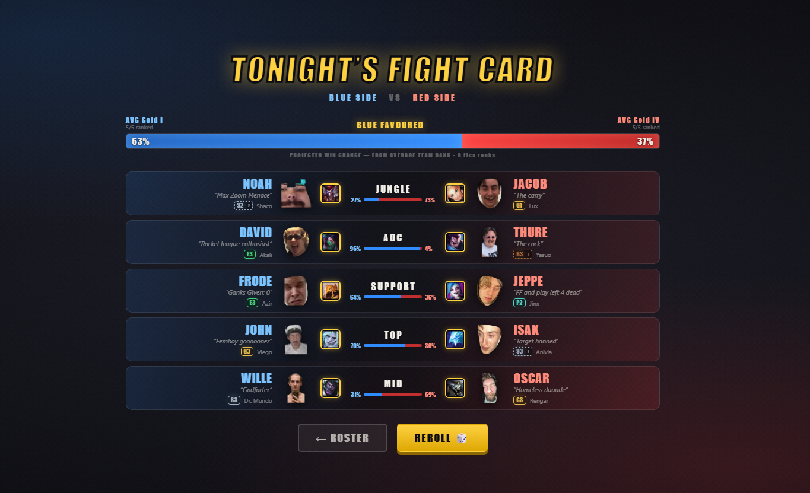

# 🥊 FIGHT NIGHT

A head-to-head randomizer for League of Legends in-house customs. Replaces the two
wheels (teams + lanes) with one big red button and a boxing-promo reveal.

Pick 10 friends → hit **FIGHT NIGHT** → faces rocket in from opposite corners, collide
mid-screen with explosions, screen shake and airhorns → ends on a fight card you can
screenshot straight into Discord.



Everything above the joke titles is real: the tier badges, the champion portraits and the
win percentages are pulled from each player's actual Riot account. The per-lane split is
the head-to-head rank gap; the bar at the top compares **average team rank**, so a strong
player still counts for his side even when he's drawn against someone unranked.

## Run it

```bash
npm install
npm run dev
```

Opens on http://localhost:5173. Screen-share it in Discord while you roll.

## Adding a friend

1. Drop their cutout PNG into `public/roster/` — e.g. `public/roster/kalle.png`
2. Add one line to `src/roster.ts`:

```ts
{ id: 'kalle', name: 'KALLE', nickname: 'The Griefer', img: '/roster/kalle.png' },
```

That's it. **Transparent background is ideal, but padding doesn't matter** — the app
scans each image's alpha channel at load and auto-crops to the face, so every portrait
fills its frame the same way regardless of how the PNG was cut out.

`nickname` is optional. Leave it off and they get a random hype tag every roll
(`MID DIFF ENJOYER`, `FLASHES INTO WALLS`, ...). Add more to `HYPE_TAGS` in the same file.

The roster can hold any number of people — you select exactly 10 per night, and your
selection is remembered between sessions.

Four of the faces have alternate takes already sitting in `public/roster/`
(`isak-alt.png`, `jeppe-alt.png`, `mcuz-alt.png`, `wibring-alt.png`) if you prefer a
different photo — just point the `img` at one of those.

## Live stats (rank, most-played champs, win rates)

Optional, but it's the good stuff: real rank badges, their 3 most-played champions with
real portraits, win rates from recent games — and **betting odds derived from the actual
rank gap**, so a Diamond vs a Silver reads as the massacre it is.

### Why not op.gg?

It can't be done. op.gg has no public API, their private one is CORS-blocked so a browser
can't call it, and scraping it breaks their ToS. Same for u.gg and Porofessor. **Riot's
own API is the only supported path** — it's free, and it's what op.gg is built on anyway.

### Setup

**1. Add everyone's Riot ID to `src/roster.ts`.** This is the new `GameName#TAG` format,
not the old summoner name — it's in the top-right of their profile in the client:

```ts
{ id: 'jacob', name: 'JACOB', nickname: 'The Architect',
  img: '/roster/jacob.png', riotId: 'OllePlockarN#EUW' },
```

`name` stays the **display name** on the fight card. `riotId` is the **in-game name**,
shown underneath it. Everyone defaults to EUW — add `platform: 'eun1'` for anyone who isn't.

Check your work without spending an API call:

```bash
npm run sync-stats -- --dry-run
```

**2. Get a Riot API key** at [developer.riotgames.com](https://developer.riotgames.com).
Sign in, and a **Development key** is on the dashboard immediately — free, instant.

⚠️ **Development keys expire every 24 hours.** That's fine: the key is only needed when
you *sync*, never when you *run the app*. Grab a fresh one whenever you want to refresh
everyone's stats. (A Personal key doesn't expire but takes a few days to approve.)

**3.** Copy `.env.example` → `.env`, paste the key in, then:

```bash
npm run sync-stats
```

That writes `src/data/playerStats.json`. **The app reads that file and never calls Riot
at runtime** — so there's no API key needed to play, no latency mid-reveal, and it works
offline while you're screen-sharing.

### ⚠️ Invisible characters in Riot IDs

If you **copy a Riot ID out of the League client**, it drags an invisible Unicode
character along with it — `U+2066 LEFT-TO-RIGHT ISOLATE`, which the client uses so tags
render correctly next to right-to-left names.

`Name#⁦EUW` and `Name#EUW` look **identical in an editor**, but the first one 404s against
the API forever. This bit us on three players.

The sync now strips these automatically and tells you which ones it cleaned — but
`--dry-run` flags them too, so check there first. Real letters are never touched
(`Frodević` keeps his `ć`).

### Notes

- This is **fully optional and per-player.** No key, no Riot ID, or an unranked player
  all still work — they just fall back to the joke stat bars and fictional odds.
- Two people sharing one Riot ID is a **hard error** — otherwise one of them silently
  wears the other's rank and champion pool, and nothing looks broken.
- `npm run preview-odds` prints the real rank-derived line for every possible bout, so
  you can see who the books favour before you even roll.
- Win rates need match-history crawling (~30 matches each), which is slow on a dev key's
  rate limit. Matches are cached in `.cache/`, so re-syncs are fast. Skip it entirely
  with `npm run sync-stats -- --no-winrates`.
- Odds only go real when **both** fighters have a rank. Otherwise it's back to fiction,
  and the board says which you're looking at.

## Controls

| key | |
|---|---|
| `SPACE` / click | skip to the next bout |
| `ESC` | jump straight to the fight card |
| 🔊 (top right) | mute |

## Cursed events

There's a **25% chance** per roll that one lane gets cursed:

- **🔀 PLOT TWIST** — those two swap teams
- **🌋 EARTHQUAKE** — the lane shatters and re-draws its fighters
- **💀 CURSED LANE** — loser buys food

The first two **actually change the result** — they're not a bluff. The reveal shows the
original pairing, plays the curse, and lands on the real one, and the fight card at the
end always agrees with what you watched. (`scripts/verify-randomizer.mjs` hammers this
over 20,000 rolls: every player appears exactly once, teams are always 5v5, and every
curse reconciles with the final card.)

`CURSED LANE` is cosmetic and says so — it changes nothing but the stakes.

## Everything else you see

- **Stat bars** (`TILT RESISTANCE`, `TOXICITY`, `GANKING IQ`, `MENTAL BOOM`) and
  **Vegas betting odds** are complete fiction, but they're seeded off each player so
  they hold still during a match and change on every reroll.
- **Every sound is synthesized** in-browser with the Web Audio API — explosions, boxing
  bell, airhorn, sirens. No audio files, works offline. If you want real samples instead,
  each sound in `src/lib/audio.ts` is a single swappable function.

## Tuning

| what | where |
|---|---|
| curse rate | `CURSE_CHANCE` in `src/lib/randomize.ts` |
| reveal pacing | the `at(ms, …)` timeline in `src/screens/LaneReveal.tsx` |
| explosion size | `spawnExplosion(x, y, scale)` in `src/fx/particles.ts` |
| colours / fonts | `:root` in `src/styles/global.css` |

## Verify

```bash
npm run verify
```

Two suites:

- **`verify-randomizer`** — 20,000 rolls. Every player appears exactly once, teams are
  always 5v5, lanes always unique, distribution uniform, and every curse reconciles with
  the final card.
- **`verify-ranks`** — walks all 93 rungs of the ladder from Iron IV to Challenger and
  asserts `rankScore()` is strictly ascending. (This caught a real bug: a 500 LP Master
  was outranking a Grandmaster, which would have silently inverted the odds.)
